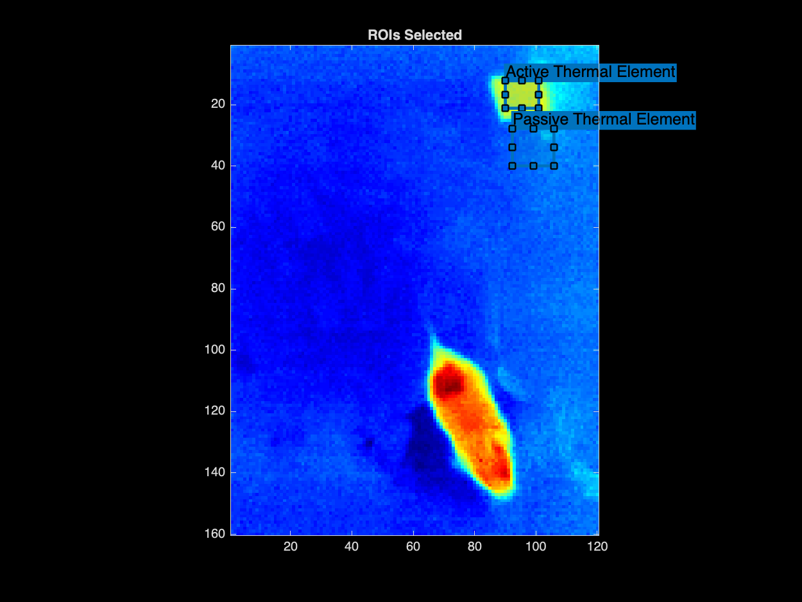
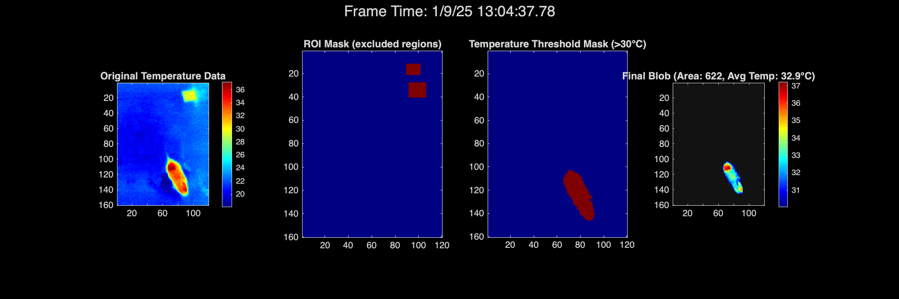
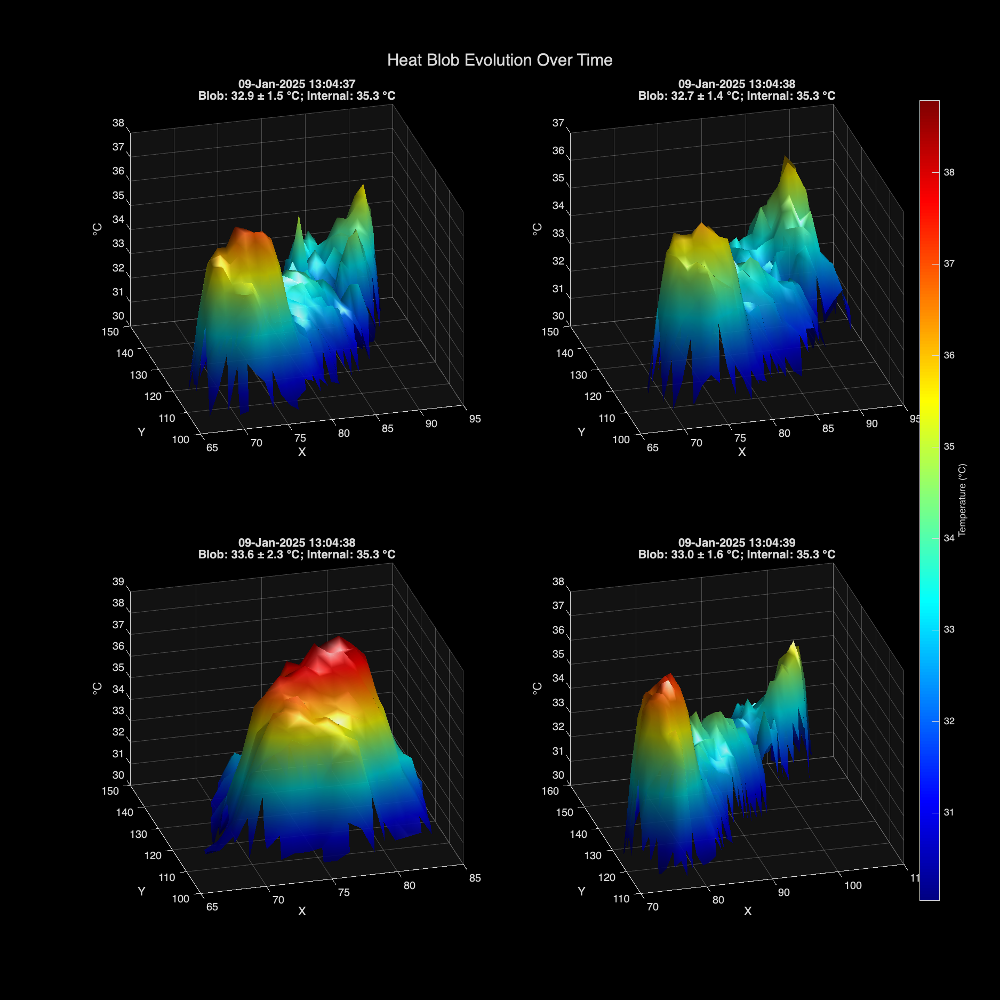

# Thermal Analysis

## Data Preparation
1. Open the thermal logger file in Excel and trim any previous data (maintain header).
2. Save the file as a CSV file into `thermalLogger.csv`.
3. Put manually logged internal body temperature data into `internalBodyTemp.csv`.

## Analysis Steps and Results

### 1. Temperature Logger Data
Initial plot showing the temperature readings from both thermal sensors and the internal body temperature over time.

### 2. Regions of Interest (ROIs)
Definition of regions of interest (ROIs) in the thermal frames, including the active thermal element and passive thermal element used for calibration.

### 3. Normalized Frames
Visualization of the thermal frames after normalization using the ROI temperature readings for calibration.

### 4. Blob Detection Steps
Diagnostic visualization showing the steps of heat blob (ie, mouse) detection:
- Original temperature data
- ROI mask showing excluded regions
- Temperature threshold mask
- Final detected blob with temperature values

### 5. Heat Blob Evolution
Final visualization showing the evolution of detected heat blobs (ie, mouse) over time, with temperature represented by both height and color. Each subplot includes the blob's mean temperature and corresponding internal body temperature.

